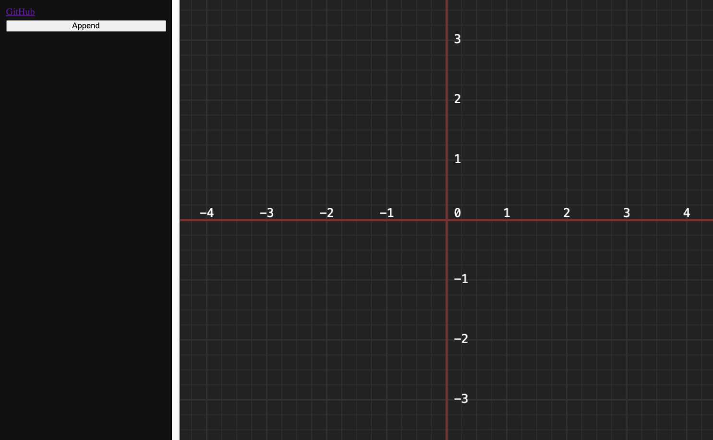
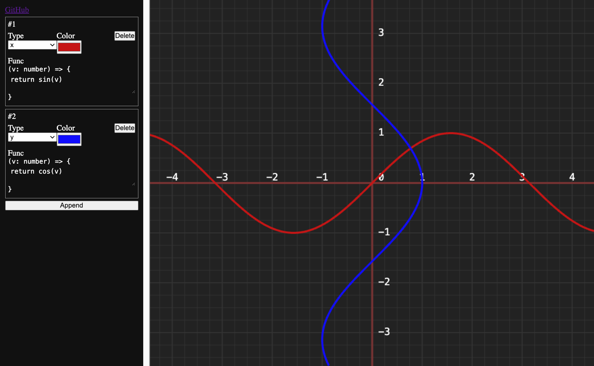
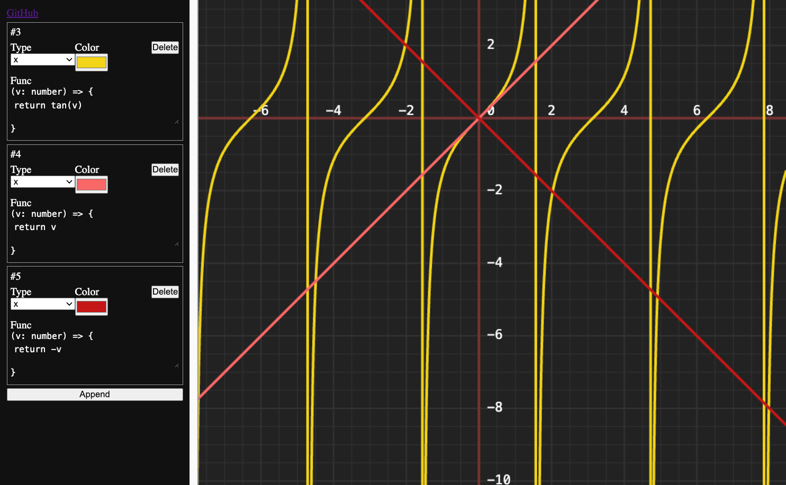

# GraphCalc

Что-то вроде графического калькулятора. Позволяет рисовать JS функции:
```ts
function (v: number): number {
  // you code
  return v;
}
```

### Онлайн демо
[Тут](https://vicimpa.github.io/graph-calc)

### Для запуска
```bash
> npm install
> npm run dev
```

### Для сборки
```bash
> npm install
> npm run build
```

### Скриншоты
>
> [](screens/screen0.png)
>

>
> [](screens/screen1.png)
>

>
> [](screens/screen2.png)
>